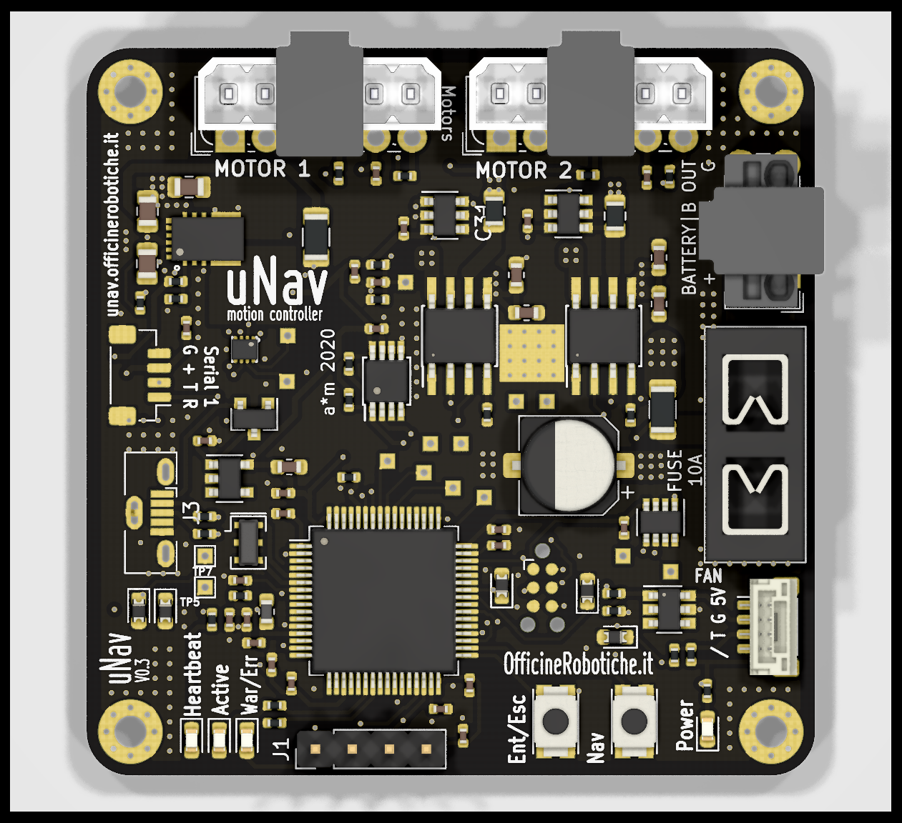
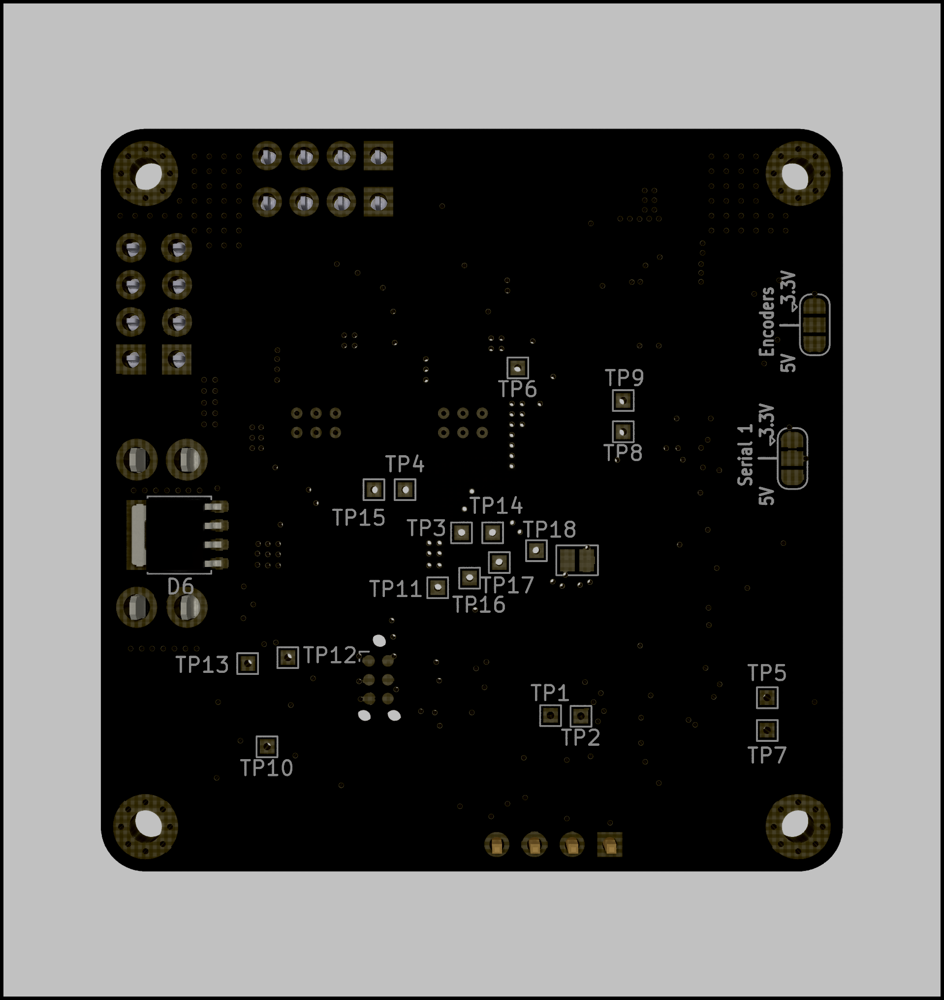

# Integrated Board
This is the first iteration of test hardware for unav2. The board includes a STM32F405 and two DRV8871 drivers.
It supports motor current feedback using two INA186 and global battery current/voltage monitor using an INA219.
Additionally there is an LM75 temperature monitor ic and a fan output.

Link to [Interactive BOM](https://htmlpreview.github.io/?https://raw.githubusercontent.com/AlessioMorale/unav2_hardware/master/integrated_board/bom/ibom.html) (built with the awesome [InteractiveHtmlBom plugin](https://github.com/openscopeproject/InteractiveHtmlBom) )

Note: Encoder, serial and fan connectors are actually JST SH series, not exactly the type shown.

